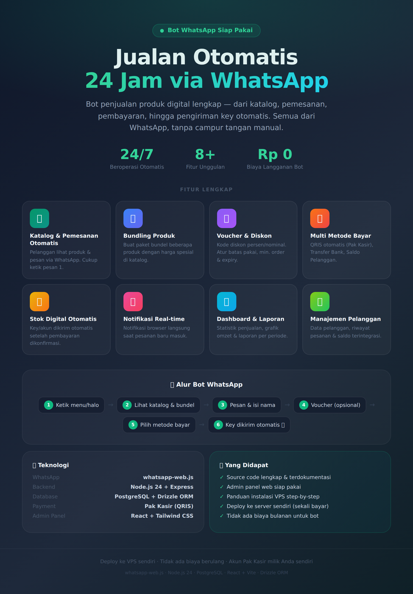

# 2️⃣ REVDWABOT

**🤖 WhatsApp Bot Penjualan Otomatis**

Bot WhatsApp siap pakai untuk menjual produk digital secara otomatis 24 jam non-stop dengan payment gateway terintegrasi.

---

## 📋 Daftar File

- **[FEATURES.md](./FEATURES.md)** - Dokumentasi lengkap semua fitur yang tersedia
- **[images/](./images/)** - Screenshot dan aset visual aplikasi
- **[docs/](./docs/)** - Dokumentasi teknis tambahan

---

## 🎯 Fitur Utama

✅ **Katalog & Pemesanan Otomatis**
- Pelanggan lihat daftar produk di WhatsApp
- Pesan cukup ketik `pesan 1`, `pesan 2`, dst
- Bot memandu proses pemesanan step by step

✅ **Bundling Produk**
- Buat paket bundel dari beberapa produk
- Tampil otomatis di katalog
- Pelanggan pesan bundel dengan kode khusus

✅ **Voucher & Diskon**
- Buat kode voucher (persentase atau nominal)
- Atur batas penggunaan & tanggal kadaluarsa
- Bot validasi voucher otomatis saat checkout

✅ **Multi Metode Pembayaran**
- QRIS (QR code otomatis)
- Transfer Bank / E-Wallet
- Saldo akun pelanggan

✅ **Stok Digital Otomatis**
- Simpan key/akun digital per produk
- Bot kirim key otomatis setelah pembayaran
- Stok berkurang otomatis

✅ **Manajemen Pesanan Real-time**
- Panel admin untuk lihat semua pesanan
- Status tracking: pending → processing → completed
- Pesanan kadaluarsa dibatalkan otomatis

✅ **Dashboard & Analytics**
- Statistik penjualan harian/mingguan/bulanan
- Laporan lengkap dengan filter periode
- Grafik omzet & jumlah transaksi

✅ **Notifikasi Real-time**
- Notifikasi browser saat ada pesanan baru
- Menggunakan teknologi SSE (Server-Sent Events)

---

## 🤖 Alur Bot WhatsApp

```
Pelanggan → halo/menu
    ↓
Bot tampilkan katalog produk
    ↓
Pelanggan → pesan 1 / bundle 1
    ↓
Bot tanya jumlah & nama
    ↓
Bot tanya kode voucher (opsional)
    ↓
Pilih metode pembayaran
    ↓
Link/instruksi dikirim otomatis
    ↓
Pembayaran dikonfirmasi
    ↓
Key/produk dikirim otomatis
```

---

## 🛠️ Teknologi

- **WhatsApp:** whatsapp-web.js (tanpa API berbayar)
- **Backend:** Node.js + Express
- **Frontend:** React + Tailwind CSS
- **Database:** PostgreSQL
- **Payment:** Pak Kasir (QRIS)

---

## 📦 Yang Didapat

| Item | Status |
|------|--------|
| Source code lengkap | ✅ |
| Admin panel web | ✅ |
| Setup & instalasi | ✅ |
| Dokumentasi VPS | ✅ |
| Update fitur | Sesuai paket |

---

## 📱 Screenshot & Demo

Folder `images/` berisi screenshot lengkap aplikasi. Lihat:
- `wabot-features.png` - Fitur-fitur bot

```markdown

```

---

## 📖 Baca Lengkapnya

👉 **[Lihat semua fitur detail →](./FEATURES.md)**

---

## 🔗 Link Repository

- 📦 [Source Code](https://github.com/Dropking1122/REVDWABOT)
- 👤 [Developer](https://github.com/Dropking1122)

---

**Catatan:** Aplikasi siap deploy ke VPS sendiri. Tidak ada biaya langganan bulanan untuk bot-nya.

